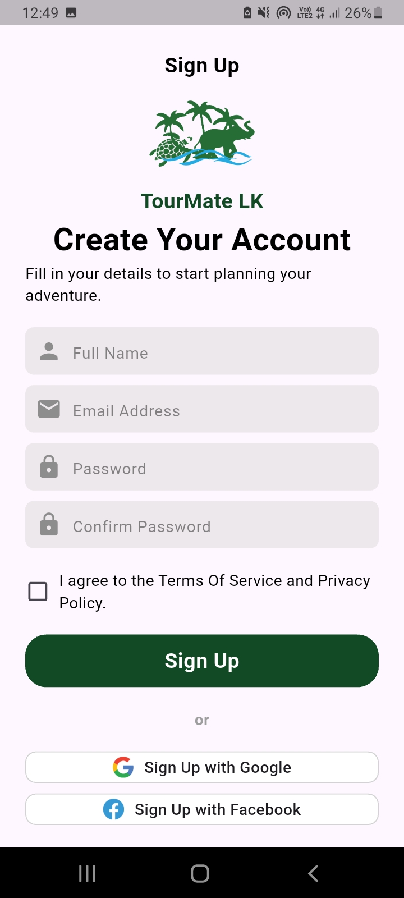
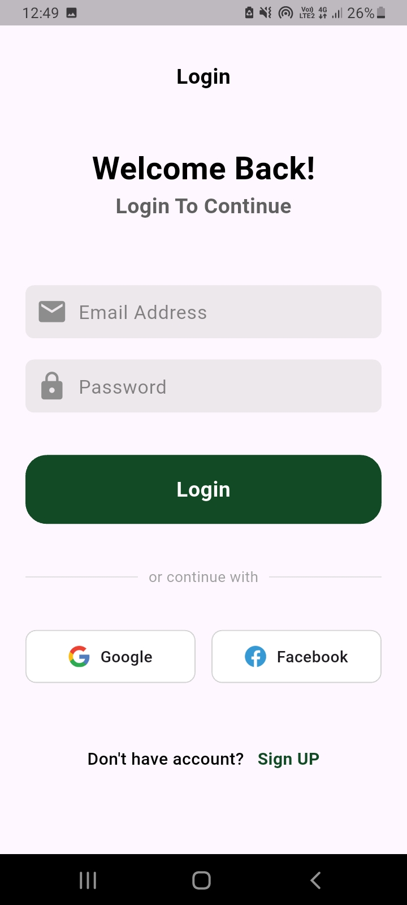

# 🌍 TourMate LK

**TourMate LK** is a smart digital travel companion and personalized itinerary planner mobile application tailored for exploring Sri Lanka. Built using **Flutter** and **Firebase**, the app aims to provide tourists and locals with seamless, real-time location discovery and optimized tour guiding.

---

## ✨ Key Features

* 🗺️ **Interactive Maps & Search**: Easily discover nearby attractions, historical landmarks, and hidden gems across Sri Lanka.
* 📅 **Smart Itinerary Planner**: Plan your trips by setting preferences like the number of travelers, travel dates, and budget.
* 🚦 **Route Optimization**: Get the most efficient route for your trips to save time and travel smart.
* 📂 **Saved Places & Trips**: Bookmark your favorite destinations and manage your planned itineraries on the go.
* 📱 **User-Friendly UI**: A clean, modern, and intuitive user interface designed for seamless navigation.

---

## 🛠️ Tech Stack

* **Frontend**: Flutter (Dart)
* **Backend & Database**: Firebase Auth, Cloud Firestore
* **APIs & Libraries**: Google Maps API (or Mapbox), Location Services

## 📱 App UI Screenshots

  
  
  

